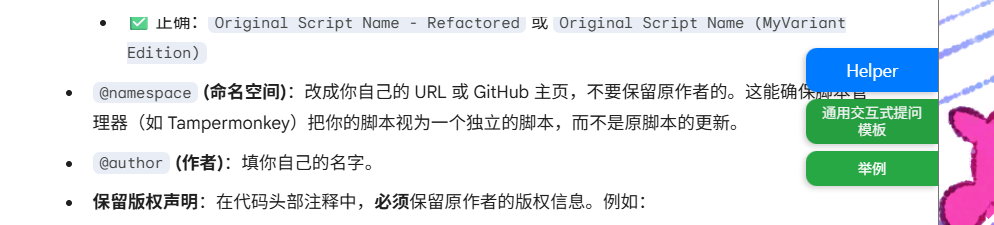

# PromptHelper - Universal AI Assistant Userscript

**Language**: [English](https://github.com/Scarlet1ssimo/PromptHelper) | [中文](https://github.com/Scarlet1ssimo/PromptHelper/blob/master/README-zh.md)

A powerful universal userscript that provides intelligent Prompt template management across 10 mainstream AI platforms. Features one-click template application, smart content reading from chat input, and advanced template management with site-specific defaults.

Modified from Sauterne's [PromptHelper](https://github.com/dongshuyan/PromptHelper) to support multiple templates.

Current effect:

## 📞 Contact

- **Author**: Scarlet1ssimo
- **Original Author**: Sauterne
- **Original Project URL**: https://github.com/dongshuyan/PromptHelper
- **Original Script URL**: https://greasyfork.org/zh-CN/scripts/545456-prompthelper
- **License**: MIT
- **Latest Version**: v1.7.0

---

> **💡 Tip**: PromptHelper makes AI interactions more efficient and effective. Try the one-click template application for immediate improvements to your AI conversations!